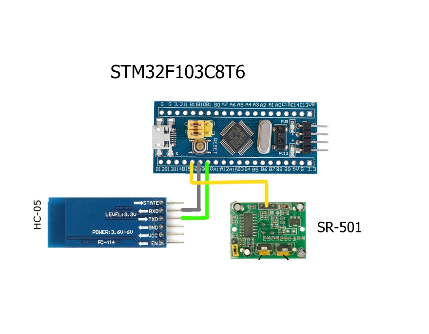
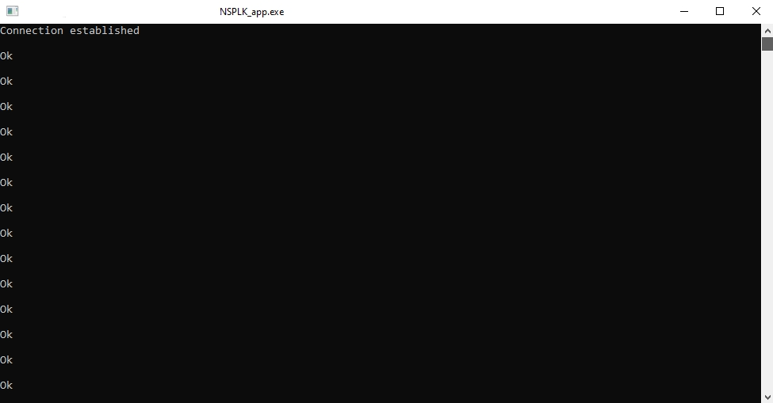
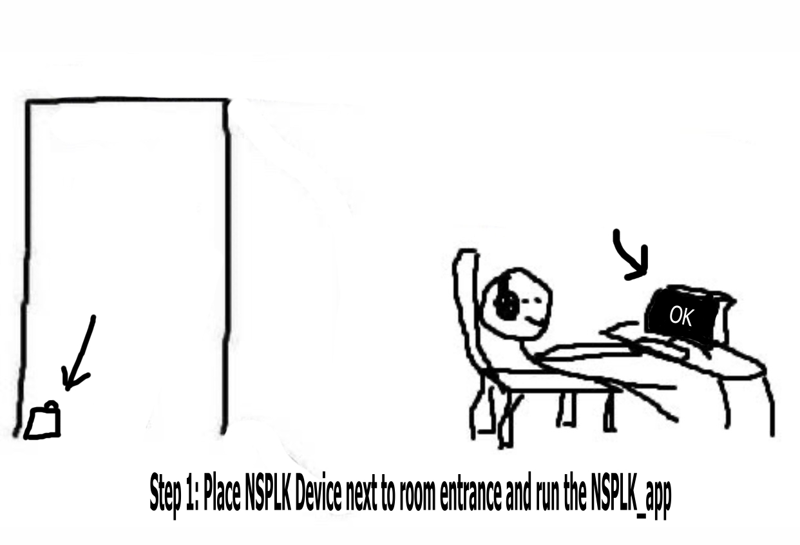
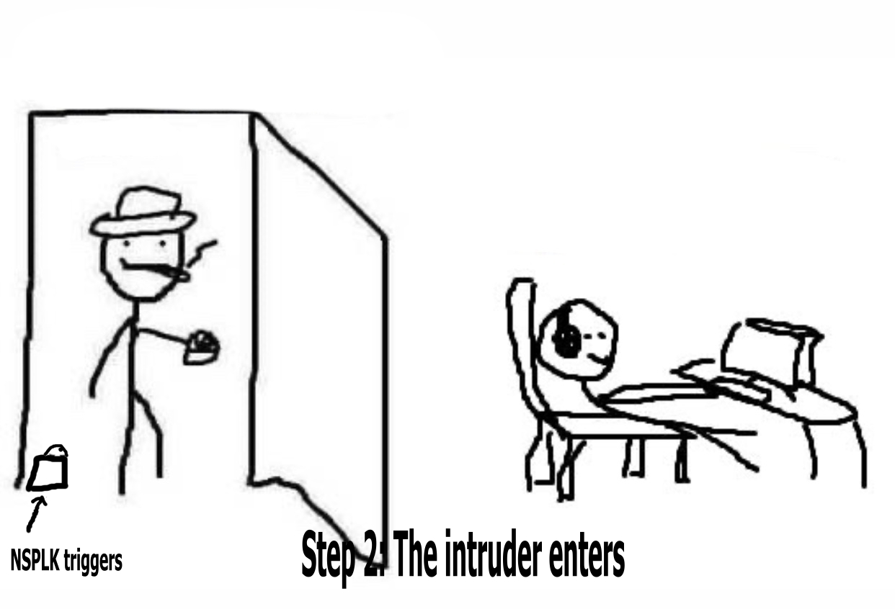
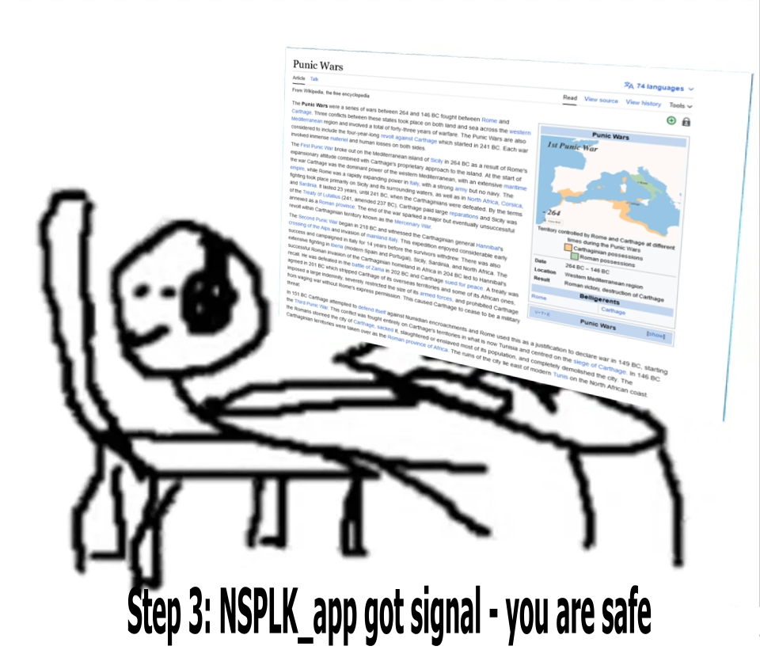

# NSPLK is the bluetooth motion sensor device with app provided which can be used as monitor content safety tool against room intruders
### Circuit

### Things you need to do before using
* #### Start NSPLK device and pair it (HC-05) with your pc via bluetooth
* #### Compile NSPLK_app and start it. It will log "OK" every sec if everything is okay.

### How to use it?

